# Jarkom TCP-UDP

## TCP

### Soal 1
What is the IP address and TCP port number used by the client computer (source)
that is transferring the alice.txt file to gaia.cs.umass.edu? To answer this
question, it’s probably easiest to select an HTTP message and explore the details
of the TCP packet used to carry this HTTP message, using the “details of the
selected packet header window” (refer to Figure 2 in the “Getting Started with
Wireshark” Lab if you’re uncertain about the Wireshark windows).

##### Jawaban
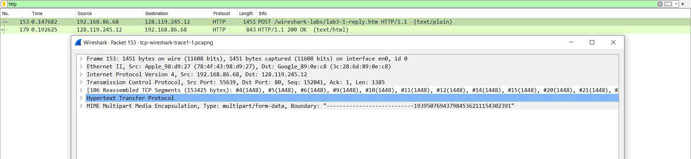

IP = 192.168.86.68  
Port = 55639

### Soal 2
What is the IP address of gaia.cs.umass.edu? On what port number is it sending
and receiving TCP segments for this connection?

##### Jawaban
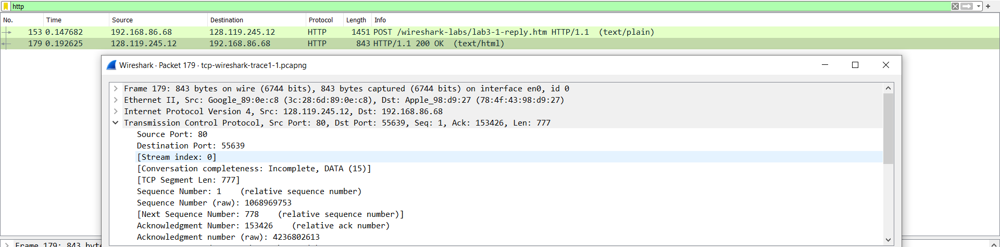

IP = 128.119.245.12  
Port = 80

### Soal 3
What is the sequence number of the TCP SYN segment that is used to initiate the
TCP connection between the client computer and gaia.cs.umass.edu? (Note: this
is the “raw” sequence number carried in the TCP segment itself; it is NOT the
packet # in the “No.” column in the Wireshark window. Remember there is no
such thing as a “packet number” in TCP or UDP; as you know, there are sequence
numbers in TCP and that’s what we’re after here. Also note that this is not the
relative sequence number with respect to the starting sequence number of this
TCP session.). What is it in this TCP segment that identifies the segment as a
SYN segment? Will the TCP receiver in this session be able to use Selective
Acknowledgments (allowing TCP to function a bit more like a “selective repeat”
receiver, see section 3.4.5 in the text)?

##### Jawaban
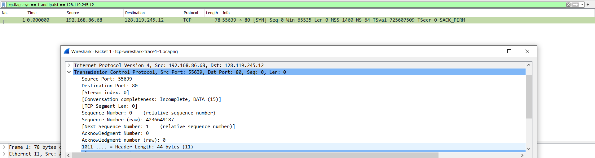

Sequence raw = 4236649187  
Flag 0x002 mengidentifikasi segment sebagai SYN  
Iya, karena sack diijinkan di paket

### Soal 4
What is the sequence number of the SYNACK segment sent by gaia.cs.umass.edu
to the client computer in reply to the SYN? What is it in the segment that
identifies the segment as a SYNACK segment? What is the value of the
Acknowledgement field in the SYNACK segment? How did gaia.cs.umass.edu
determine that value? 

##### Jawaban
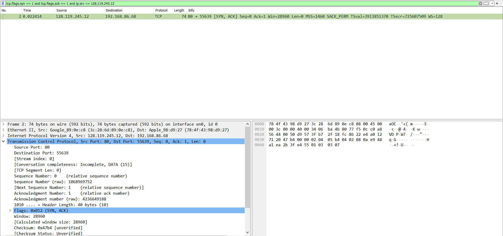

Sequence Number : 1068969752  
Karena di flag ada SYN dan ACK  
Acknowledgment number : 4236649188  
Dari nomer syn sebelumnya ditambah 1 

### Soal 5
What is the sequence number of the TCP segment containing the header of the
HTTP POST command? Note that in order to find the POST message header,
you’ll need to dig into the packet content field at the bottom of the Wireshark
window, looking for a segment with the ASCII text “POST” within its DATA
field. How many bytes of data are contained in the payload (data) field of this
TCP segment? Did all of the data in the transferred file alice.txt fit into this single
segment?

##### Jawaban
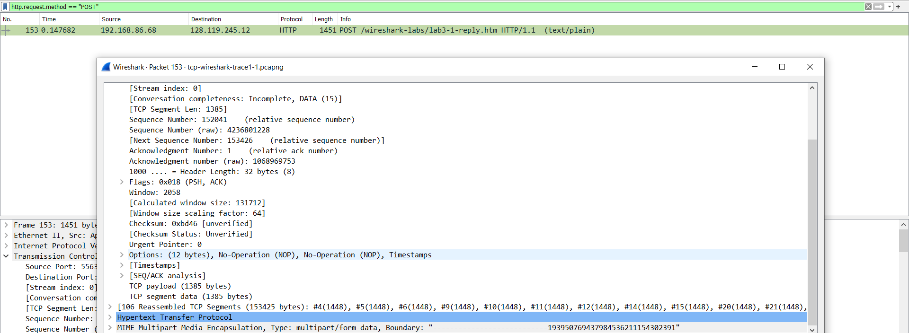

Sequence Number: 152041  
Sequence Number (raw): 4236801228  
TCP payload (1385)  
Tidak

### Soal 6
Consider the TCP segment containing the HTTP “POST” as the first segment in
the data transfer part of the TCP connection.
 At what time was the first segment (the one containing the HTTP POST) in
the data-transfer part of the TCP connection sent?
 At what time was the ACK for this first data-containing segment received?
 What is the RTT for this first data-containing segment?
 What is the RTT value the second data-carrying TCP segment and its ACK?
 What is the EstimatedRTT value (see Section 3.5.3, in the text) after the
ACK for the second data-carrying segment is received? Assume that in
making this calculation after the received of the ACK for the second segment,

##### Jawaban
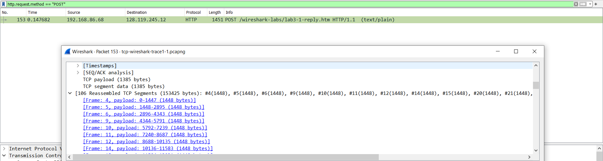
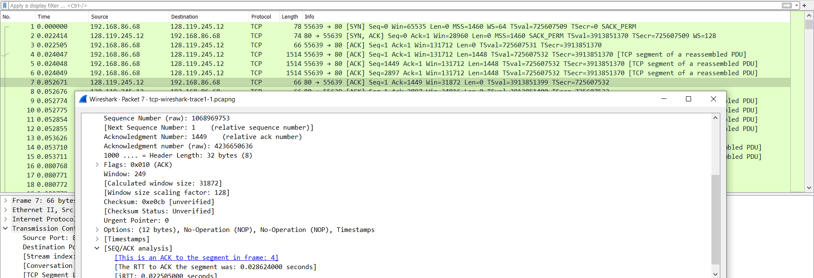
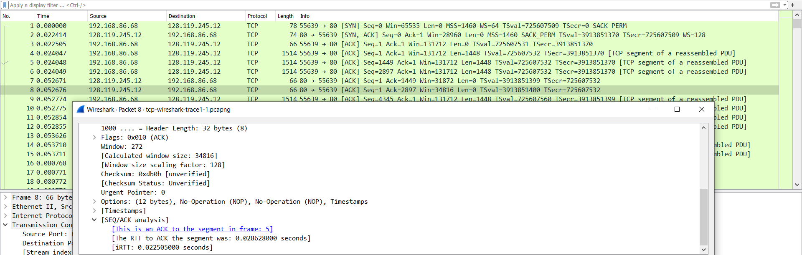

0.24047  
0.052671  
0.028624000  
0.028628000 

### Soal 7 
What is the length (header plus payload) of each of the first four data-carrying
TCP segments?

##### Jawaban
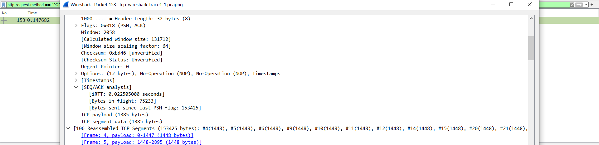

4 (Header + Payload) = 4 (32 + 1448) = 4 (1480) = 5920 byte

### Soal 8 
What is the minimum amount of available buffer space advertised to the client by
gaia.cs.umass.edu among these first four data-carrying TCP segments7? Does the
lack of receiver buffer space ever throttle the sender for these first four datacarrying segments?

##### Jawaban
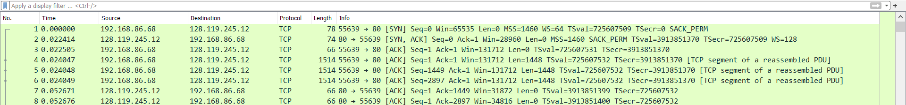

Win = 131712  
Tidak, karena nilai win selalu lebih besar dari length

### Soal 9 
Are there any retransmitted segments in the trace file? What did you check for (in
the trace) in order to answer this question?

##### Jawaban
Ada  
Ada paket yang sequence number paket selanjutnya tidak lebih besar dari sequence number paket sebelumnya.

### Soal 10
How much data does the receiver typically acknowledge in an ACK among the
first ten data-carrying segments sent from the client to gaia.cs.umass.edu? Can
you identify cases where the receiver is ACKing every other received segment
(see Table 3.2 in the text) among these first ten data-carrying segments?

##### Jawaban

1448 byte  
Paket 6 memiliki 4344 byte yang berasal dari frame frame sebelumnya

### Soal 11
What is the throughput (bytes transferred per unit time) for the TCP connection?
Explain how you calculated this value.

##### Jawaban

### Soal 12
Use the Time-Sequence-Graph(Stevens) plotting tool to view the sequence
number versus time plot of segments being sent from the client to the
gaia.cs.umass.edu server. Consider the “fleets” of packets sent around t = 0.025, t
= 0.053, t = 0.082 and t = 0.1. Comment on whether this looks as if TCP is in its
slow start phase, congestion avoidance phase or some other phase. Figure 6 shows
a slightly different view of this data.

##### Jawaban

### Soal 13
These “fleets” of segments appear to have some periodicity. What can you say
about the period?

##### Jawaban

### Soal 14
Answer each of two questions above for the trace that you have gathered when
you transferred a file from your computer to gaia.cs.umass.edu

##### Jawaban

### Soal 15
What is the throughput (bytes transferred per unit time) for the TCP connection?
Explain how you calculated this value.

##### Jawaban

## UDP

### Soal 1
Select the first UDP segment in your trace. What is the packet number4 of this
segment in the trace file? What type of application-layer payload or protocol
message is being carried in this UDP segment? Look at the details of this packet
in Wireshark. How many fields there are in the UDP header? (You shouldn’t
look in the textbook! Answer these questions directly from what you observe in
the packet trace.) What are the names of these fields?

##### Jawaban
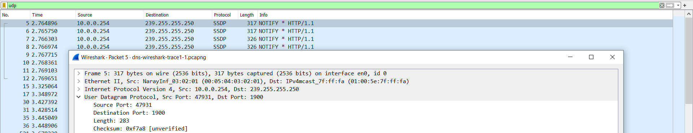

No Paket : 5  
SSDP  
4 field, source port, destination port, length, dan checksum

### Soal 2
By consulting the displayed information in Wireshark’s packet content field for
this packet (or by consulting the textbook), what is the length (in bytes) of each of
the UDP header fields?

##### Jawaban
8 byte, 2 byte untuk setiap field

### Soal 3
The value in the Length field is the length of what? (You can consult the text for
this answer). Verify your claim with your captured UDP packet. 

##### Jawaban
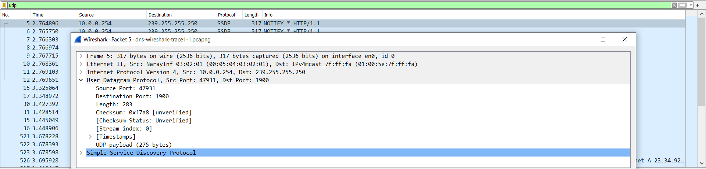

Field length merupakan panjang keseluruhan segmen UDP dari header dan payload  
Header = 8  
Payload = 275  
Field length = 275+8 = 283

### Soal 4
What is the maximum number of bytes that can be included in a UDP payload?
(Hint: the answer to this question can be determined by your answer to 2. above)

##### Jawaban
Maximum value for a 16-bit field = 65,535  
UDP headers = 8  
The maximum payload size : 65,535 – 8 = 65,527 

### Soal 5
What is the largest possible source port number? (Hint: see the hint in 4.)

##### Jawaban
2^16 - 1 = 65535, karena port direpresentasikan dengan 16 bit

### Soal 6
What is the protocol number for UDP? Give your answer in decimal notation. To
answer this question, you’ll need to look into the Protocol field of the IP datagram
containing this UDP segment (see Figure 4.13 in the text, and the discussion of IP
header fields). 

##### Jawaban
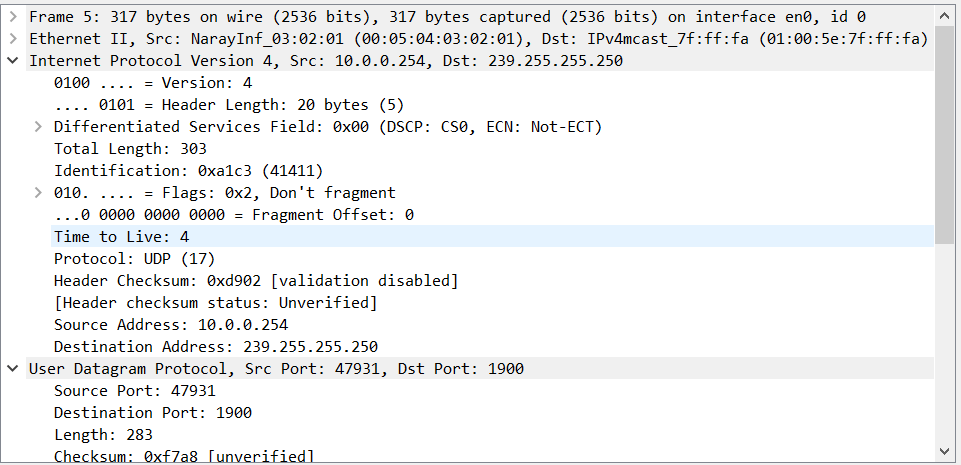
17

### Soal 7
Examine the pair of UDP packets in which your host sends the first UDP packet
and the second UDP packet is a reply to this first UDP packet. (Hint: for a second
packet to be sent in response to a first packet, the sender of the first packet should
be the destination of the second packet). What is the packet number5 of the first
of these two UDP segments in the trace file? What is the packet number6 of the
second of these two UDP segments in the trace file? Describe the relationship
between the port numbers in the two packets. 

##### Jawaban
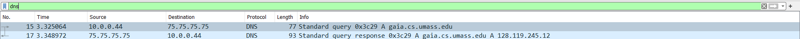
15  
17  
ip src paket 15 merupakan ip dest pakett 17 dan sebaliknya

